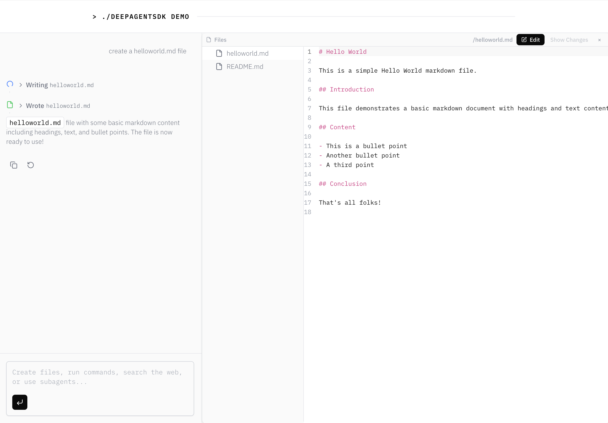

# deepagentsdk Demo



A demonstration of [deepagentsdk](https://github.com/chrispangg/deepagentsdk) integration with Next.js, showcasing an AI agent with real-time file operations, command execution, and event streaming.

For more information, see the [deepagentsdk documentation](https://deepagentsdk.dev/docs).

## What is deepagentsdk?

deepagentsdk is a TypeScript SDK for building AI agents with tool use capabilities. It provides:

- **Sandbox Backends**: Isolated environments where agents can safely execute code and manipulate files
- **Event Streaming**: Real-time visibility into agent operations (26+ event types)
- **Tool Management**: Automatic tool registration for file operations, commands, web search, and more
- **React Hooks**: Frontend integrations for chat interfaces

## What This Demo Shows

This app demonstrates a full-stack Next.js application with:

- **AI Chat Interface**: Interactive chat with an AI agent powered by Claude
- **File Operations**: Create, read, edit, and search files in real-time
- **Command Execution**: Run shell commands (Node.js, Bun, Python, etc.)
- **Live Event Streaming**: Watch every agent action as it happens
- **File Explorer**: Browse and edit files created by the agent
- **Todo Queue**: Track agent progress through multi-step tasks

## Architecture

```
┌─────────────────┐         ┌─────────────────┐         ┌─────────────────┐
│   Frontend      │         │   Next.js API   │         │   deepagentsdk  │
│  (React 19)     │◄────────┤   /api/chat     │◄────────┤   DeepAgent     │
│                 │ Stream  │                 │ Events  │                 │
│  - Chat UI      │         │  - Agent config │         │  - LocalSandbox │
│  - File Explorer│         │  - Auth hooks   │         │  - Tool routing │
│  - Event Display│         │  - State mgmt   │         │  - Event stream │
└─────────────────┘         └─────────────────┘         └─────────────────┘
                                                                      │
                                                                      ▼
                                                            ┌─────────────────┐
                                                            │  LocalSandbox   │
                                                            │  (File System)  │
                                                            │  .sandbox-      │
                                                            │   workspace/    │
                                                            └─────────────────┘
```

### Key Components

**Backend** (`src/app/api/chat/route.ts`):

- Creates a `LocalSandbox` for isolated file operations
- Initializes `DeepAgent` with Claude Haiku model
- Uses `createElementsRouteHandler` for event streaming

**Frontend** (`src/app/page.tsx`):

- Split-screen layout (chat + file explorer)
- `useChatFullEvents` hook for state management
- Real-time event displays for files, commands, web searches, subagents

## Getting Started

### Prerequisites

- Node.js 18+ or Bun
- An Anthropic API key ([get one here](https://console.anthropic.com/))

### Installation

1. Clone the repository:

```bash
git clone <repository-url>
cd deepagentsdk-demo
```

1. Install dependencies:

```bash
bun install
```

1. Create `.env` file:

```bash
ANTHROPIC_API_KEY=your_api_key_here
TAVILY_API_KEY=your_api_key_here  # optional, if you want to use the web search tools
```

1. Run the development server:

```bash
bun run dev
```

1. Open [http://localhost:3000](http://localhost:3000)

## Usage Examples

Try these prompts to see the agent in action:

### File Creation

```
Create a React counter component with increment/decrement buttons
```

### Project Setup

```
Initialize a new TypeScript project with Express and add a "hello world" route
```

### Code Editing

```
Create a Python script that calculates fibonacci numbers and save it as fib.py
```

### Multi-Step Tasks

```
Set up a simple Next.js app with a page that displays the current time
```

## Supported Event Types (26)

The app demonstrates full event streaming for:

- **File Operations**: `file-write-start`, `file-written`, `file-edited`, `file-read`, `ls`, `glob`, `grep`
- **Commands**: `execute-start`, `execute-finish`
- **Web**: `web-search-start`, `web-search-finish`, `http-request-start`, `http-request-finish`, `fetch-url-start`, `fetch-url-finish`
- **Subagents**: `subagent-start`, `subagent-finish`, `subagent-step`
- **And more**: Text, tool calls, reasoning, sources, artifacts, checkpoints...

## Tech Stack

- **Framework**: Next.js 16.1.1 (React 19.2.3)
- **AI SDK**: deepagentsdk v0.14.0, @ai-sdk/anthropic v3.0.9
- **Model**: Claude Haiku 4.5 (fast, cost-effective)
- **UI**: Tailwind CSS, Radix UI, Monaco Editor
- **File Viewer**: @git-diff-view/react for diff visualization

## Customization

### Change the AI Model

Edit `src/app/api/chat/route.ts`:

```typescript
const agent = createDeepAgent({
  model: anthropic("claude-sonnet-4-5-20251001"), // or claude-opus-4-5
  // ...
});
```

### Adjust Agent Behavior

Modify the system prompt in the route handler:

```typescript
systemPrompt: `You are a specialized expert in...`
```

### Configure Sandbox Limits

Change timeout and workspace in `src/app/api/chat/route.ts`:

```typescript
const sandbox = new LocalSandbox({
  cwd: workspaceDir,
  timeout: 120000, // 120 seconds
  env: { /* ... */ },
});
```

## Project Structure

```
src/
├── app/
│   ├── api/chat/
│   │   └── route.ts           # Agent configuration & API handler
│   └── page.tsx               # Main chat UI
├── components/
│   ├── ai-elements/           # Reusable UI components
│   ├── events/                # Event display components
│   └── file-explorer/         # File browser & editor
└── lib/
    └── use-chat-full-events.ts # Chat state management hook

.sandbox-workspace/             # Agent's working directory
```

## Learn More

- [deepagentsdk Documentation](https://github.com/anthropics/deepagentsdk)
- [Next.js Documentation](https://nextjs.org/docs)
- [Anthropic API Documentation](https://docs.anthropic.com/)

## License

MIT

---
